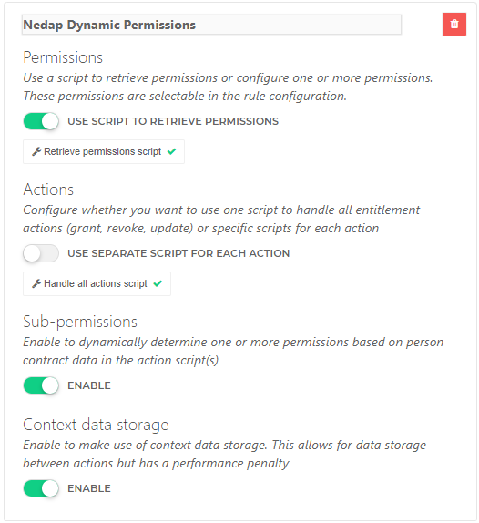
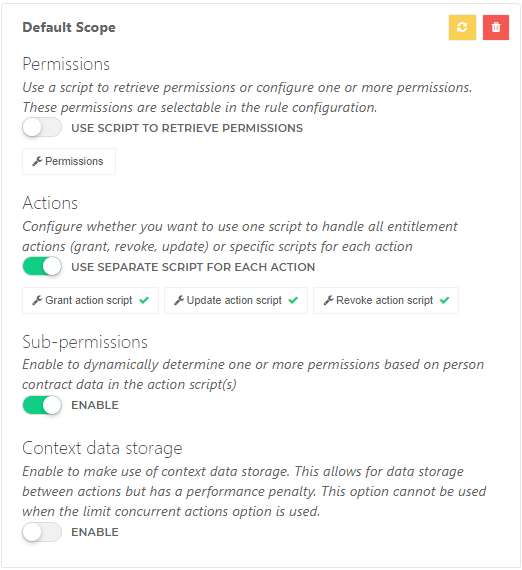
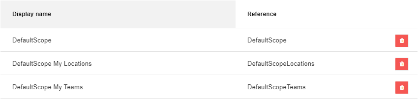

# HelloID-Conn-Prov-Target-NedapONS-Users-ReadMe

| :information_source: Information |
|:---------------------------|
| This repository contains the connector and configuration code only. The implementer is responsible to acquire the connection details such as username, password, certificate, etc. You might even need to sign a contract or agreement with the supplier before implementing this connector. Please contact the client's application manager to coordinate the connector requirements.       |

<br />

> :warning: **_Information_**
> This connector requires the existence of Nedap Employees inside Nedap Ons. Limited Nedap employee support can be achieved using [this connector](https://github.com/Tools4everBV/HelloID-Conn-Prov-Target-NedapONS-Employee-Readme).
Extensive knowledge of HelloID provisioning and Nedap Ons (Nedap user and Nedap employee) are required.


> :warning: **_Information_**
> It is important to note that the processing order of this connector may work slightly differently from other connectors in the HelloID platform. This is because this connector supports multiple accounts per HelloID Person. *(See Remark: [Business Rules Validation Check](#business-rules-validation-check) and [Processing Multiple Accounts](#processing-multiple-accounts)*


<br />

<p align="center">
  
</p>

## Versioning
|     | Description                                                                       | Date       |
| --- | ----------------------------------------------------------------------------------| ---------- |
|     | Implemented authorization changes of Nedap Ons. With a certain impact on both the DefaultScope and Role entitlements. <br> This includes the addition of two extra role  and two additional default scope entitlements. <br> :warning: *Might have implications on earlier implementations read: [DefaultScope](#defaultscope)* <br> :warning: *Please ensure that this change is made before September 1, 2024, as there is a deadline set by Nedap.*  |2024-03-20|
|     | Update error handling "Account reference dependency" from `Warning` to `Error`  <br> Bug fix for the account object in Updates.ps1     | 2023-12-13 |
|     | Updated DefaultScope management. Moved DefaultScope to operate as Permissions. <br> :warning: *Might have implications on earlier implementations read: [Permission Displayname](#permission-displayname)* | 2022-12-28 |
|     | Added Support for managing DefaultScope <br> Added Resource.ps1 validation script | 2022-06-15 |
|     | Added Role assignments with role and DefaultScope                                  | 2022-03-24 |
|     | Initial release                                                                    | 2021-08-27 |

> :warning: Upgrade warning!
> Since the last update in March 2024, Nedap has altered the authorization structure, which has had an impact on the API. The connector has been adjusted to integrate these changes in the API while also providing backward compatibility support. For further details, refer to: [DefaultScope](#defaultscope),  [Roles Permissions](#roles-permissions) and [Deprecated Code in the connector](#deprecated-code-in-the-connector)


<!-- TABLE OF CONTENTS -->
## Table of Contents
- [HelloID-Conn-Prov-Target-NedapONS-Users-ReadMe](#helloid-conn-prov-target-nedapons-users-readme)
  - [Versioning](#versioning)
  - [Table of Contents](#table-of-contents)
  - [Introduction](#introduction)
  - [Getting Started](#getting-started)
    - [Connection settings](#connection-settings)
    - [Prerequisites](#prerequisites)
    - [Remarks](#remarks)
      - [Connector Scope](#connector-scope)
      - [DataStorage](#datastorage)
      - [Single Agent](#single-agent)
      - [Permission DisplayName](#permission-displayname)
      - [MappingFiles](#mappingfiles)
      - [Account reference Validation Check](#account-reference-validation-check)
      - [Processing Multiple Accounts](#processing-multiple-accounts)
      - [Preview Mode (dryRun):](#preview-mode-dryrun)
      - [Account Object](#account-object)
      - [DefaultScope](#defaultscope)
        - [Roles Permissions (myTeams, MyLocations)](#roles-permissions-myteams-mylocations)
      - [Deprecated Code in the connector](#deprecated-code-in-the-connector)
      - [Known Issue](#known-issue)
    - [Provisioning](#provisioning)
    - [Create:](#create)
    - [Update:](#update)
    - [Delete:](#delete)
    - [Roles Permissions](#roles-permissions)
    - [Roles Grant | Update | Revoke](#roles-grant--update--revoke)
    - [DefaultScope Permissions](#defaultscope-permissions)
    - [DefaultScope Grant/Update/Revoke](#defaultscope-grantupdaterevoke)
    - [Supported Properties](#supported-properties)
  - [Fact Sheet](#fact-sheet)
    - [Remote Nedap documentation](#remote-nedap-documentation)
  - [Setup the connector](#setup-the-connector)
      - [Permissions.ps1  (Roles)](#permissionsps1--roles)
      - [DefaultScope-Grant.ps1](#defaultscope-grantps1)
      - [Create.ps1](#createps1)
      - [Update.ps1](#updateps1)
  - [HelloID Docs](#helloid-docs)
  - [Forum Thread](#forum-thread)


## Introduction
This Repository does only contain the README. The source code can be found in a private repository and is meant only for internal use. Link to the repository: [Nedap Ons Users](https://github.com/Tools4everBV/HelloID-Conn-Prov-Target-NedapONS-Users)

Nedap Ons provides a REST API to programmatically interact with its services and data. The connector manages the Nedap accounts, DefaultScope, and Provisioning roles. The roles and the Defaultscope can be assigned as entitlement and the scope of the teams and locations are calculated based on a specified property in the HelloID contracts. To map the property to the actual Nedap Team or Location additional mapping is required.


## Getting Started

### Connection settings

The following settings are required to connect to the API.

| Setting                         | Description                                                                                                 |
| ------------------------------- | ----------------------------------------------------------------------------------------------------------- |
| Environment URL API             | https://api-staging.ons.io                                                                                  |
| Certificate (.PFX) Path         | Full path to Certificate> Nedap-cert.pfx                                                                    |
| Certificate Password            | Password of the certificate                                                                                 |
| Mapping File (Locations)        | The Path to the mapping file (HR Location => Nedap location 1:M) *Example can be found in the asset folder* |
| Mapping File (Teams)            | The Path to the mapping file (HR Teams =>  Nedap Teams 1:M)  *Example can be found in the asset folder*     |
| Directory Cache Locations Teams | Cache directory for current Nedap Ons locations and current Nedap Ons teams                                 |
| CSV Delimiter                   | Mapping File CSV Separation Character                                                                       |
| Explicit Mapping                 | When Enabled, rows that consist of explicit mappings involving both the department and title are not accumulated with rows that solely contain department-related information  |
| Validate Team and Location      | Enable validation of mapped locations and teams                                                             |


### Prerequisites

- Direct HR employees synchronization with Nedap to manage the employees in Nedap
- A valid Nedap Certificate (Tools4ever needs to request a certificate by Nedap to access the API)
 - Mapping between HR departments to Nedap Clients/Locations for determining the scope for the Nedap Provisioning roles and possibly for the DefaultScope.

- Mapping between HR Teams to Nedap Team/Employee for determining the scope for the Nedap Provisioning roles and possibly for the DefaultScope.
 - Determine the scope **Types** that are required for the role assignments. The connector supports default **twelve scope possibilities**. The overview can be overwhelming to the customer in the entitlement overview. This means that there are ten entitlements created per Nedap Role. Please remove the entitlement types which not apply to your needs, by removing the code in the entitlement script.

- The HelloID DataStorage must be enabled

- A custom property on the HelloID contract with a combination of the employeeCode and EmploymentCode named: [custom.NedapOnsIdentificationNo]
Example:
  ```javascript
  function getValue() {
      return sourceContract.PersonCode + "-" + sourceContract.EmploymentCode
  }
  getValue();
  ```


### Remarks
#### Connector Scope
  This connector only manages the users and the authorizations. And is intended to be used along with a direct sync HR. AFAS for example. So the Employee objects are not managed in this connector. The connector depends on this sync. When an employee object is not found the user cannot be created.

#### DataStorage
  The connector uses DataStorage to keep track of the current permissions (Provisioning Roles). The DataStorage is behind a feature flag so must be enabled before it can be used in your tenant.

#### Single Agent
  Since this connector is using DataStorage, all actions are executed one at a time. Therefore our best practice is the usage of one HelloID Agent for this connector. Also accessing the required local certificate file and CSV mapping files might result in slower processing and/or file locks.

#### Permission DisplayName
 The display names of the permissions in HelloID are cached, and they only refresh after a specific time limit has been reached. As a result, the display name of the permissions is not directly saved in HelloID and therefore, not in the PowerShell scripts. Previous versions of the system, before December 28, 2022, relied on this display name. However, this dependency has been removed. Unfortunately, previously granted permissions will not be automatically corrected with the new display name and will continue to rely on the old display name. To avoid any issues caused by this, you can implement the following code as a temporary fix until all the granted permissions are re-granted.
  ```Powershell
  if ('DisplayName' -notin $pRef.PSObject.Properties.name  ) {
      if ($eRef.PermissionDisplayName -ne '<unknown permission>') {
          $pRef | Add-Member -NotePropertyMembers @{
              DisplayName = "$($eRef.PermissionDisplayName.Split('-')[1].trim(' '))"
          }
      }
  }
  ```
<br>

#### MappingFiles
The mapping files are used for both role assignments and the default scope in the permission scripts. It is assumed that the application between HR and Nedap is the same. The mapping are used to determine the custom teams and locations, explicitly for the calculated role assignment or the teams and locations in the default scope.

#### Account reference Validation Check
> :warning: *Known error: *No HelloID Account reference(s) found!**

In certain situations, an employment with the reference number 1000467-1 may have an account entitlement, while another employment with the reference number 1000467-2 has been granted permissions for the Defaultscope or Provisioning Role. This leads to a mismatch between the account reference and the contracts in scope. The mismatch results from an incorrect configuration of the Business Rules. The connector checks for this mismatch and generates an error and an audit log. Unfortunately, there is a second use case where an account reference cannot be checked beforehand. When an account is not created correctly in the update script, the permission script triggers after 24 hours to update the permissions because the processing order is not forced. *(Read more: [HelloId Processin order](https://docs.helloid.com/en/provisioning/enforcement.html))*
As a result, the permissions script keeps failing until the account is created in the second use case, or in the first use case when the business rules are modified to match the requirements. After this, the problem will be automatically resolved in the next scheduled/manual enforcement

A drawback of this processing is that the account with a correctly filled account reference gets updated in Nedap Ons. However, because the HelloId action failed, it keeps retrying until the issue with the other account is resolved, also causing the 'correct' account to receive updates each time. Additionally, the desired permissions are not saved in the data storage. When another permission is triggered from HelloID, it gets overwritten because the desired permission is not stored in the data storage. The same problem exists if the business rule has been configured incorrectly.

#### Processing Multiple Accounts

Due to the support for multiple accounts within Nedap, the Update task may result in the removal of an account. This scenario presents a problem, as the default process order for revoking a trigger is to first revoke the permissions and then revoke the account entitlement. As a result, permissions are revoked before the account entitlement is outside of scope. This process is described in the HelloID documentation. However, in our particular scenario, the process operates differently. The update task first removes the account, resulting in the process order being reversed, with the account revocation occurring before the permission is revoked. This difference in process order leads to the removed account reference not appearing in the permission task, making it impossible to remove the associated permissions. The permission script subsequently performs a cleanup process to revoke the permissions of the previously removed accounts during the next run. However, this is not a straightforward process and will only be triggered during the next specific permission update or when manually prompted to update the permissions.

> :bulb: Tip: To get a closing solution, you can specify the account and permission entitlements in distinct business rules. Additionally, it is suggested to configure the permission entitlement to be out of scope before the account entitlement during off-boarding or re-boarding procedures... To prevent out-of-sync permissions.

#### Preview Mode (dryRun):
Note that in preview mode (DryRun), all HelloID contracts of a Person are in scope. Therefore, it does not simulate the actual outcome when it comes to determining which account or permissions should be created, updated, or deleted. However, this DryRun mode is added to verify if the mapping, configuration setting, etc. are present and correct. The contracts in scope are normally configured in the business rules. This cannot be stimulated in Preview.

#### Account Object
The output presented in the result object merely represents a subset of the available data. When additional data is required, it can be obtained from the raw dataset.

#### DefaultScope
The DefaultScope consists of three entitlements, whereas the **"Defaultscope" entitlement only exists for backward compatibility**. This entitlement is merely a combination of the other two: Locations and Teams. So, when you grant both entitlements; DefaultScopeTeams and DefaultScopeLocations, the result is the same as the entitlement DefaultScope. You can use them both simultaneously, but they will overwrite the previous permissions, resulting in conflicts.

##### Roles Permissions (myTeams, MyLocations)
In addition to **DefaultScope**, the same applies to the default scope in role assignments. The default scope assignment is also present for backward compatibility. Therefore, the recommended practice is to use the specific entitlements **DefaultScopeTeams** and **DefaultScopeLocations**.

#### Deprecated Code in the connector
During the changes in the connector in march, some deprecated code was left in place to minimize code changes, making it easier to upgrade the connector in existing implementations. However, this has an impact on the connector:
  - The `AllClients` and `MySelf` logic remains in the Defaultscope logic despite it not being used anymore.
  - Not all the logging has been updated to reflect the new names of the permissions. For example, when granting DefaultScopeTeams, the logging might still return Defaultscope.
  - The Defaultscope entitlement and the default scope role assignment are only retained to avoid changes in the business rules when updating an existing implementation.


#### Known Issue
Known Issue: Unable to remove a Nedap role from the Data Storage after it has been deleted in Nedap. [Known Issue: Remove Nedap Role DataStorage](https://forum.helloid.com/forum/helloid-connectors/general/4988-known-issue-a-removed-nedap-role-saved-in-the-helloid-datastroage)
### Provisioning
Using this connector you will have the ability to create and manage the following items in Nedap:


| Files                   | Description                                                                                       |
| ----------------------- | ------------------------------------------------------------------------------------------------- |
| Create.ps1              | Creates or Correlates the user in the target system                                               |
| Update.ps1              | Creates, updates, or deletes Account references                                                     |
| Delete.ps1              | Removes account reference(s)  _(Success = True)_                                                  |
| Permission.ps1          | Grant/Update/Revoke Nedap Provisioning Roles                                                      |
| Entitlements.ps1        | Get Nedap Roles, with 12 options _(See below)_                                                    |
| DefaultScope            | Static values, you can use the defaultScopeEntitlements script or enter three static entitlements like [DefaultScope Permissions](#defaultscope-permissions)|
| DefaultScope Grant.ps1  | Grant/Set Defaultscope (myTeams and myLocations) calculated based on external Mapping. Because the Connector Support multiple accounts per Person, the permission Update script must also be used. You can place the Grant script here since this works in both situations.                                      |
| DefaultScope Revoke.ps1 | Revoke Defaultscope (myTeams and myLocations)                                                                       |
| Resource.ps1            | Create validation files to check against the given Nedap location a team Ids in the mapping files |


### Create:

* Multiple user accounts for each unique combination (employeeId + contact sequence number), based on the contracts in condition from the Business Rules
*
  Result:
  * One entitlement “Nedap Account”
  * A list of account references that can be used throughout the account lifecycle.
  *	Audit Logs for each account created.


### Update:
* The update script does not make changes to an account, it's not required.
* Create a new user account for each new unique (employeeId + contact sequence number) combination.
* Delete Remove account reference from Aref -*See delete action* -

  Result:
    * Audit Logs for each account (Create, Update, Delete)
    *	Update the account reference with the new situation.
    *	The entitlement overview should be the same.


### Delete:
*  Remove (all) account references
  Result:
    * Remove the Entitlement "Nedap Account"
    *	Remove the Account Reference in HelloID
    *	Audit Logs for each account deleted

### Roles Permissions
*	List Nedap Provisioning Roles (Name + GUID)
* Entitlement options: *(Please keep only the scopes the customer need)*
    * Custom Scope
      * Clients
        * All Clients
        * Clients on my Roster
        * Clients on my Planning
        * No Clients
        * Calculated Clients based on Contracts (External Mapping required)
      * Teams
        * All Teams
        * No Teams
        * Calculated Teams based on Contracts (External Mapping required)
    * DefaultScoped
    * DefaultScopedTeams
    * DefaultScopedLocations
    * RoleScoped

### Roles Grant | Update | Revoke
All in One Script
*(Sequenced after Account lifecycle)*

  * Calculate the desired permissions as a sum of the current Permissions/Entitlements plus the new permission and assign all the Nedap roles at once.

    Result
    * Permission for each entitlement
    *	Audit Logs for each entitlement with a summary of the Scope (Location and Teams) of the Nedap Role.
    * SubPermissions for each entitlement with an Account and location/team combination


### DefaultScope Permissions
- Static values: you can use the `defaultScopeEntitlements.ps1` script or enter three static entitlements. These values are then used in the permissions (Defaultscope). The preferable way is to use the script to avoid typos. Make sure that the "references" match the following values.
   - DefaultScope
   - DefaultScopeTeams
   - DefaultScopeLocations

### DefaultScope Grant/Update/Revoke
Separate Scripts
*(Sequenced after the Account lifecycle)*

- The DefaultScope, or the teams and locations, can be set in Nedap. Therefore, the DefaultScope can be configured as permission in HelloID. The scope of an account will be calculated based on the contracts in scope against an external mapping file. You can find an example of such a mapping file in the Assets folder.
  Result:
     - Grant
       - For each account one or two Audit Logs with a summary of the DefaultScope  (Location and Teams) are separated Logs.
       - SubPermissions: For each account a set of the applied DefaultScope.
     - Update *(Use Grant script)*
       - For each account one or two Audit Logs with a summary of the DefaultScope  (Location and Teams) are separated Logs.
       - SubPermissions: For each account a set of the applied DefaultScope.
     - Revoke
       - Audit logs for each account reference.


### Supported Properties
| PropertyName            | Notes                                                  |
| ----------------------- | ------------------------------------------------------ |
| ContractRequiredAtLogin |                                                        |
| SsoEnabled              |                                                        |
| PasswordChange          |                                                        |
| UserName                | Mapped as employee number + Employment Sequence Number |


___________

## Fact Sheet
The following table displays an overview of the functionality of the Nedap Ons connector for HelloID Provisioning and Service Automation.

|Nedap Accounts |Supported by Nedap    |Supported by HelloID provisioning |Supported by HelloID Service Automation|
| ------------ | ----------- |----------- |----------- |
| Create Accounts|Yes|Yes|No
| Update Accounts  |Yes|Yes|No
| Delete Accounts |Yes|No, not applicable|No
| Disable Accounts |No|No|No
| Set initial Password |No|No|No
| Password Reset |No, *This works only if the account was created in Nedap. Due to a bug in the API*  |No|No
|Set Dashboard profiel |No|No|No
<br/>


| Nedap Authorizations                                     | Supported by  Nedap                                         | Supported by  HelloID provisioning                                                                                                                                                                                              | Supported by HelloID Service Automation |
| -------------------------------------------------------- | ----------------------------------------------------------- | ------------------------------------------------ | --------------------------------------- |
| Set a user's DefaultScope *(MyTeams and MyLocations)* (standaard bereik)             | Yes                                                         | :warning: Yes, We strongly advise you to contact Tools4ever first before using this feature, *Additional mapping is required.*  <br> 	:warning: This feature requires an additional endpoint relative to existing implementations! | No                                      |
| Assign role with custom scope (aangepast bereik)         | Yes                                                         | Yes                                                                                                                                                                                                                             | No                                      |
| Set default scope (standaard bereik) (myTeams and myLocations) in role assignment       | Yes       | :warning: Yes, We strongly advise you to contact Tools4ever first before using this feature                                                                                   | No                                      |
| Set role scope (rol bereik) in role assignment           | Yes       | Yes                                                                                                                                                                           | No                                      |
| Set custom Locations (Clienten) scope in role assignment | Yes                                                         | Yes, using a custom scope, my roster, and my planning. *Additional mapping required*                                                                                                                                             | No                                      |
| Set custom Teams (Medewerkers) scope in role assignment  | Yes                                                         | Yes, using a custom scope. *Additional mapping required*                                                                                                                                                                        | No                                      |
| Set duration of scope (ValidFrom / ValidTo)              | No, *This should be managed in HelloID with business rules* | No                                                                                                                                                                                                                              | No                                      |


### Remote Nedap documentation
* Nedap API Documentation → [klik](https://www.ons-api.nl/APIS.html)
* Nedap Ons Authorization manual → [klik](https://ons-api.nl/support/Shield.html)


## Setup the connector

* Before using this connector make sure you enter the configuration and replace the following variables.<br>
 

* Besides the configuration tab, you can also configure script variables. To decide which property from a HelloID contract is used to look up a value in the mapping table, this is known as the HR Location or HR Team. And you can configure the MySelf property for the Defaultscope. Please note that some "same" configuration must be taken place in multiple scripts. Shown as below:

#### Permissions.ps1  (Roles)

  ```PowerShell
  $TeamProperty1              = { $_.Department.ExternalId }           # Mandatory
  $TeamProperty2              = { $_.Title.ExternalId }                # Not mandatory
  $locationProperty1          = { $_.Department.ExternalId }           # Mandatory
  $locationProperty2          = $null # { $_.Title.ExternalId }        # Not used
  $employmentContractFilter   = { $_.Custom.NedapOnsIdentificationNo } # Dienstverband
  ```
#### DefaultScope-Grant.ps1

  ```PowerShell
  #lookup Value of the person object
  $teamLookupField1           = { $_.Department.ExternalId }             # Mandatory
  $teamLookupField2           = { $_.Title.ExternalId }                  # Not mandatory
  $locationLookupField1       = { $_.Department.ExternalId }             # Mandatory
  $locationLookupField2       = { $_.Title.ExternalId }                  # Not mandatory
  $employmentContractFilter   = { $_.Custom.NedapOnsIdentificationNo }   # Dienstverband
  $IsGrantMySelf              = $false                                   # Set Scope (MySelf)
  ```

#### Create.ps1

  ```PowerShell
$employmentContractFilter     = { $_.Custom.NedapOnsIdentificationNo }  # Dienstverband
  ```

#### Update.ps1

  ```PowerShell

$employmentContractFilter     = { $_.Custom.NedapOnsIdentificationNo }  # Dienstverband
  ```


* Configure the Permission definition (Provisioning Roles) as follows: <br>


* Configure the Permission definition (DefaultScope) as follows:<br>


<br>

 - Use the script `defaultScopeEntitlements.ps1` with three static permissions or add them manually. The display name can be changed according to customer requirements, but the reference should match the values in the example. These values are used in the connector as a reference<br>



_For more information about our HelloID PowerShell connectors, please refer to our general [Documentation](https://docs.helloid.com/hc/en-us/articles/360012558020-How-to-configure-a-custom-PowerShell-target-connector) page_

## HelloID Docs

The official HelloID documentation can be found at: https://docs.helloid.com/

## Forum Thread
The Forum thread for any questions or remarks regarding this connector can be found at: [Helloid-prov-target-nedap-ons-users](https://forum.helloid.com/forum/helloid-connectors/provisioning/313-helloid-prov-target-nedap-ons-users)


