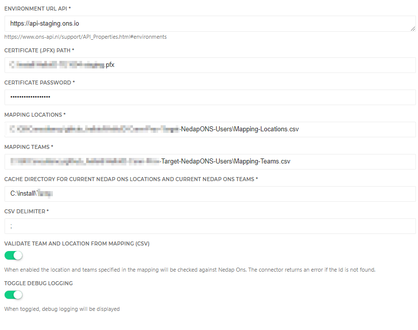

# HelloID-Conn-Prov-Target-NedapONS
<p align="center">
  
</p>

<!-- TABLE OF CONTENTS -->
## Table of Contents
* [Introduction](#introduction)
* [Getting Started](#getting-started)
* [Provisioning](#provisioning)
  * [Accounts life Cylce](#accounts-life-cylce)
    * [Create](#create)
    * [Update](#update)
    * [Delete](#delte)
    * [GetPersmissions](#getpersmissions)
    * [Grand](#grand)
    * [Persmissions Grant/Update/Revoke](#Persmissions-Grant/Update/Revoke)
* [Fact Sheet](#Fact-Sheet)
  * [Remote Nedap documentatie](#Remote-Nedap-documentatie)
* [Setup the connector](Setup-The-Connector)
* [Connector Improvements (Todo)](#Connector-Improvements-(Todo))
* [HelloID Docs](#helloid-docs)
* [Forum Thread](#forum-thread)


## Introduction
This Repository does only contains the readme. The source code can be found in a private Repositry and is meant only for internal use. Link to Repositry: [Nedap Ons Users](https://github.com/Tools4everBV/HelloID-Conn-Prov-Target-NedapONS-Users)

Nedap Ons provides an REST API to programmatically interact with its services and data.
The connector manages Nedap account and Provisioning roles. The roles can be assigned as entitlement and the scope of the teams and locations are calculated based on property in the HelloID contracts. To map the property to actual Nedap Teams or Locations an additional mapping is required.


## Getting Started

### Connection settings

The following settings are required to connect to the API.

| Setting     | Description |
| ------------ | ----------- |
| Environment URL API     |    https://api-staging.ons.io                                     |
| Certificate (.PFX) Path    |  Fullpath to Certificate> Nedap-cert.pfx                       |
| Certificate Password |    Password of the certificate                                       |
| Mapping File (Locations)|  The Path to the mapping file (HR Location => Nedap Loaction 1:M) |
| Mapping File (Teams)|  The Path to the mapping file (HR Teams =>  Nedap Teams 1:M)          |
|Directory Cache Locations Teams|  Cache directory for current Nedap Ons locations and current Nedap Ons teams      |
| CSV separation Character| Mapping File CSV Separation Character         |
|Validate Team and Location|  Enable validation of mapped locations and teams       |


### Prerequisites

 - Direct HR employees synchronization with Nedap to manage the employees in Nedap
- A valid Nedap Certificate (Tools4ever need to requests a certificate by Nedap to access the API)
- Mapping between HR departments to Nedap Clients/Locations for determining the scope for the Nedap Provisioning roles
- Mapping between HR Teams to Nedap Team/Employee for determining the scope for the Nedap Provisioning roles.
- The HelloID DataStorage must be enabled
- An custom property on the HelloID contract with a combination of the employeeCode and EmploymentCode named: [custom.NedapOnsIdentificationNo]
Example:
  ```javascript
  function getValue() {
      return sourceContract.PersonCode + "-" + sourceContract.EmploymentCode
  }
  getValue();
  ```


### Remarks

 - This connector does only manages the users and the authorizations. And is intended to be used along with a direct sync HR. AFAS for example. So the Employee objects are not managed in this connector. The connector depends on this sync. When an employee object is not found the user cannot be created.
 - The connector uses DataStorage to keep track of the current permissions. The DataStorage is behind a feature flag so must be enabled before it can be used in your tenant.

### Provisioning
Using this connector you will have the ability to create and manage the following items in Nedap:


| Files       | Description                                             |
| ----------- | ------------------------------------------              |
| Create.ps1  | Creates or Correlates the user in the target system   |
| Update.ps1  | Creates, update or deletes Account references           |
| Delete.ps1  |  Removes account reference(s)    _(Success = True)_      |
| permission.ps1 | Grant/Update/Revoke Nedap Roles                      |
| entitlements.ps1  |  Get Nedap Roles, with 6 options _(See below)_ |


#### Create:

* Multiple user accounts for each unique combination (employeeId + contact sequence number), based on the contracts in condition from the Business Rules

  Result:
  * One entitlement “Nedap Account”
  * A list of account references that can be used in the account lifecycle.
  *	Audit Logs for each account created.


#### Update:
* Update does not make changes, It's not required
* Create new user account for each new unique (employeeId + contact sequence number) combination.
* Delete  Remove account reference from Aref  -*See delete action* -

  Result:
    * Audit Logs for each account (Create, Update, Delete)
    *	Update the account reference with the new situation.
    *	The entitlement overview should be the same.


#### Delete:
*  Remove account reference from AccountReferences
  Result:
    * Remove the Entitlement "Nedap Account"
    *	Remove the Account Reference in HelloID
    *	Audit Logs for each account deleted

#### Get Permissions
*	Get Nedap Provisioning Roles (Name + GUID)
  Entitlement options
    * All Clients
    * No Clients
    * Calculated Clients based on Contracts (External Mapping is needed)
    * All Teams
    * No Teams
    * Calculated Teams based on Contracts (External Mapping is needed)

#### Permissions Grant/Update/Revoke

*(Sequenced after Account lifecycle)*
  * Calculate the desired permissions as a sum of the current Permissions/Entitlements plus the new permission and assign all the Nedap roles at once.

    Result
    * Permission for each each entitlement
    *	Audit Logs for each entitlement with a summary of the Scope (Location and Teams) in the Nedap Role.
    * SubPermissions for each entitlement with an Account and location/team combination


## Fact Sheet
The following table displays an overview of the functionality for the Nedap Ons connector for HelloID Provisioning and Service Automation.

|Nedap Accounts |Supported by  Nedap    |Supported by  HelloID provisioning |Supported by HelloID Service Automation|
| ------------ | ----------- |----------- |----------- |
| Create Accounts|Yes|Yes|No
| Update Accounts  |Yes|Yes|No
| Delete Accounts |Yes|No, not applicable|No
| Disable Accounts |No|No|No
| Set initial Password |No|No|No
| Password Reset |No , *This works only if the account was original created in Nedap. Due to a bug in the API*  |No|No

<br/>


|Nedap Authorizations |Supported by  Nedap    |Supported by  HelloID provisioning |Supported by HelloID Service Automation|
| ------------ | ----------- |----------- |----------- |
| Assign Authorizations Roles |Yes|Yes|No
| Set a users DefaultScope |Yes|No|No
| Set default scope with Role assignment|Yes |No|No
| Set custom Locations (Clienten) scope|Yes|Yes, *Additional mapping required*|No
| Set custom Teams (Medewerkers) scope|Yes|Yes, *Additional mapping required*|No
| Set duration of scope (ValidFrom / ValidTo) |No, *This should be managed in HelloID with business rules*|No|No


### Remote Nedap documentatie
* Nedap API Documentation → [klik](https://www.ons-api.nl/APIS.html)
* Nedap ONS Authorization manual → [klik](https://ons-api.nl/support/Shield.html)


## Setup the connector

* Before using this connector make sure you enter the configuration and replace the following variables.
 

* Beside the configuration tab you can also configure in the Grant/Revoke script, the department and the team property. To determine which property from the HelloID contract, the mapping should be looking for a value. This is know as the HR Location or HR Team.

  ```PowerShell
  $TeamProperty1              = { $_.Department.ExternalId }  # Mandatory
  $TeamProperty2              = { $_.Title.ExternalId }  # Not mandatory
  $locationProperty1          = { $_.Department.ExternalId }   # Mandatory
  $locationProperty2          = $null # { $_.Title.ExternalId }  # Not used
  $employmentContractFilter   = { $_.Custom.NedapOnsIdentificationNo } #Dienstverband  ```
* Configure the Persmision definition as follows:


_For more information about our HelloID PowerShell connectors, please refer to our general [Documentation](https://docs.helloid.com/hc/en-us/articles/360012558020-How-to-configure-a-custom-PowerShell-target-connector) page_

### Connector Improvements (Todo)
  * [ ] Use the .net variant to serialize (System.Web.Script.Serialization.JavaScriptSerializer) the $entitlementContext , because this object can be quite large
  * [ ] Certitficaat Object - in configuration (To supports the cloudagent
  * [ ] Add Roles with Default scope <= Nedap Functionalitiy
  * [ ] Default Scope ? Update the default Scope for a user  <= Nedap Functionalitiy
  * [ ] Create new SA forms to manage the datastore
  * [ ] Add PermissionID string to entitlement reference instead of calculate in the grant script


## HelloID Docs

The official HelloID documentation can be found at: https://docs.helloid.com/

## Forum Thread
The Forum thread for any questions or remarks regarding this connector can be found at: [Helloid-prov-target-nedap-ons-users](https://forum.helloid.com/forum/helloid-connectors/provisioning/313-helloid-prov-target-nedap-ons-users)
