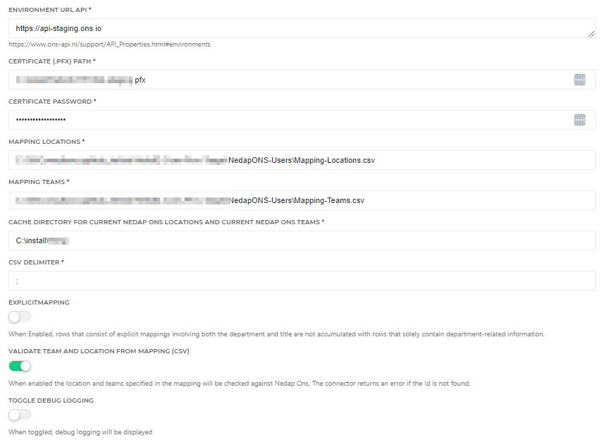

# HelloID-Conn-Prov-Target-NedapONS-Users-ReadMe

| :information_source: Information |
|:---------------------------|
| This repository contains the connector and configuration code only. The implementer is responsible to acquire the connection details such as username, password, certificate, etc. You might even need to sign a contract or agreement with the supplier before implementing this connector. Please contact the client's application manager to coordinate the connector requirements.       |

<br />

> :warning: **_Information_**
> This connector requires the existence of Nedap Employees inside Nedap Ons. Limited Nedap employee support can be achieved using [this connector](https://github.com/Tools4everBV/HelloID-Conn-Prov-Target-NedapONS-Employee-Readme).
Extensive knowledge of HelloID provisioning and Nedap Ons (Nedap user and Nedap employee) are required.


> :warning: **_Information_**
> It is important to note that the processing order of this connector may work slightly differently from other connectors in the HelloID platform. This is because this connector supports multiple accounts per HelloID Person. *(See Remark: [Business Rules Validation Check](#business-rules-validation-check) and [Processing Multiple Accounts](#processing-multiple-accounts)*


<br />

<p align="center">
  
</p>

## Versioning
|     | Description                                                                        | Date       |
| --- | ----------------------------------------------------------------------------------| ---------- |
|     | Updated DefaultScope management. Moved DefaultScope to operate as Permissions. <br> *:warning:Might have implications on earlier implementations read: [Permission Displayname](#permission-displayname)* | 2022-12-28 |
|     | Added Support for managing DefaultScope <br> Added Resource.ps1 validation script | 2022-06-15 |
|     | Added Role assignments with role and DefaultScope                                  | 2022-03-24 |
|     | Initial release                                                                    | 2021-08-27 |

> :warning: Upgrade warning!
> Since the last update on December 28, 2022, the display name for permissions has been changed. This can resolve in empty audit logging for certain actions.[Permission Displayname](#permission-displayname)


<!-- TABLE OF CONTENTS -->
## Table of Contents
- [HelloID-Conn-Prov-Target-NedapONS-Users-ReadMe](#helloid-conn-prov-target-nedapons-users-readme)
  - [Versioning](#versioning)
  - [Table of Contents](#table-of-contents)
  - [Introduction](#introduction)
  - [Getting Started](#getting-started)
    - [Connection settings](#connection-settings)
    - [Prerequisites](#prerequisites)
    - [Remarks](#remarks)
      - [Connector Scope](#connector-scope)
      - [Datastorage](#datastorage)
      - [Single Agent](#single-agent)
      - [Permission DisplayName](#permission-displayname)
      - [MappingFiles](#mappingfiles)
      - [Business Rules Validation Check](#business-rules-validation-check)
      - [Processing Multiple Accounts](#processing-multiple-accounts)
      - [Preview Mode (dryRun):](#preview-mode-dryrun)
      - [Account Object](#account-object)
    - [Provisioning](#provisioning)
    - [Create:](#create)
    - [Update:](#update)
    - [Delete:](#delete)
    - [Roles Permissions](#roles-permissions)
    - [Roles Grant | Update | Revoke](#roles-grant--update--revoke)
    - [DefaultScope Permissions](#defaultscope-permissions)
    - [DefaultScope Grant/Update/Revoke](#defaultscope-grantupdaterevoke)
    - [Supported Properties](#supported-properties)
  - [Fact Sheet](#fact-sheet)
    - [Remote Nedap documentation](#remote-nedap-documentation)
  - [Setup the connector](#setup-the-connector)
      - [Permissions.ps1  (Roles)](#permissionsps1--roles)
      - [DefaultScope-Grant.ps1](#defaultscope-grantps1)
      - [Create.ps1](#createps1)
      - [Update.ps1](#updateps1)
  - [HelloID Docs](#helloid-docs)
  - [Forum Thread](#forum-thread)


## Introduction
This Repository does only contain the README. The source code can be found in a private repository and is meant only for internal use. Link to the repository: [Nedap Ons Users](https://github.com/Tools4everBV/HelloID-Conn-Prov-Target-NedapONS-Users)

Nedap Ons provides a REST API to programmatically interact with its services and data. The connector manages the Nedap accounts, DefaultScope, and Provisioning roles. The roles and the Defaultscope can be assigned as entitlement and the scope of the teams and locations are calculated based on a specified property in the HelloID contracts. To map the property to the actual Nedap Team or Location additional mapping is required.


## Getting Started

### Connection settings

The following settings are required to connect to the API.

| Setting                         | Description                                                                                                 |
| ------------------------------- | ----------------------------------------------------------------------------------------------------------- |
| Environment URL API             | https://api-staging.ons.io                                                                                  |
| Certificate (.PFX) Path         | Full path to Certificate> Nedap-cert.pfx                                                                    |
| Certificate Password            | Password of the certificate                                                                                 |
| Mapping File (Locations)        | The Path to the mapping file (HR Location => Nedap location 1:M) *Example can be found in the asset folder* |
| Mapping File (Teams)            | The Path to the mapping file (HR Teams =>  Nedap Teams 1:M)  *Example can be found in the asset folder*     |
| Directory Cache Locations Teams | Cache directory for current Nedap Ons locations and current Nedap Ons teams                                 |
| CSV Delimiter                   | Mapping File CSV Separation Character                                                                       |
| Validate Team and Location      | Enable validation of mapped locations and teams                                                             |


### Prerequisites

- Direct HR employees synchronization with Nedap to manage the employees in Nedap
- A valid Nedap Certificate (Tools4ever needs to request a certificate by Nedap to access the API)
 - Mapping between HR departments to Nedap Clients/Locations for determining the scope for the Nedap Provisioning roles and possibly for the DefaultScope.

- Mapping between HR Teams to Nedap Team/Employee for determining the scope for the Nedap Provisioning roles and possibly for the DefaultScope.
 - Determine the scope **Types** that are required for the role assignments. The connector supports default **ten scope possibilities**. The overview can be overwhelming to the customer in the entitlement overview. This means that there are ten entitlements created per Nedap Role. Please remove the entitlement types which not apply to your needs, by removing the code in the entitlement script.

- The HelloID DataStorage must be enabled

- A custom property on the HelloID contract with a combination of the employeeCode and EmploymentCode named: [custom.NedapOnsIdentificationNo]
Example:
  ```javascript
  function getValue() {
      return sourceContract.PersonCode + "-" + sourceContract.EmploymentCode
  }
  getValue();
  ```


### Remarks

#### Connector Scope
  This connector does only manage the users and the authorizations. And is intended to be used along with a direct sync HR. AFAS for example. So the Employee objects are not managed in this connector. The connector depends on this sync. When an employee object is not found the user cannot be created.

#### Datastorage
  The connector uses DataStorage to keep track of the current permissions (Provisioning Roles). The DataStorage is behind a feature flag so must be enabled before it can be used in your tenant.

#### Single Agent
  Since this connector is using DataStorage, all actions are executed one at the time. Therefore our best practice is the usage of one HelloID Agent for this connector. Also accessing the required local certificate file and CSV mapping files might result into slower processing and / or file locks.

#### Permission DisplayName
 The display name of the permissions in HelloID are cached, and they only refresh after a specific time limit has been reached. As a result, the display name of the permissions is not directly saved in HelloID and therefore, not in the PowerShell scripts. Previous versions of the system, before December 28, 2022, relied on this display name. However, this dependency has been removed. Unfortunately, previously granted permissions will not be automatically corrected with the new display name and will continue to rely on the old display name. To avoid any issues caused by this, you can implement the following code as a temporary fix until all the granted permissions are re-granted.
  ```Powershell
  if ('DisplayName' -notin $pRef.PSObject.Properties.name  ) {
      if ($eRef.PermissionDisplayName -ne '<unknown permission>') {
          $pRef | Add-Member -NotePropertyMembers @{
              DisplayName = "$($eRef.PermissionDisplayName.Split('-')[1].trim(' '))"
          }
      }
  }
  ```
<br>

#### MappingFiles
  The mapping files are used for both the role assignments and the Default scope in the permission scripts. It is assumed that the application between HR en Nedap is the same. Although for the Defaultscope extra columns are added AllEmployees and AllClients. These columns are ignored in the role assignments. The 'All' options for the role assignments are managed with separate entitlements.

#### Business Rules Validation Check

In certain situations, an employment with the reference number 1000467-1 may have an account entitlement, while another employment with the reference number 1000467-2 has been granted permissions for the Defaultscope or Provisioning Role. This leads to a mismatch between the account reference and the contracts in scope. This mismatch is a result of an incorrect configuration of the Business Rules. The connector checks for this mismatch and will generate a "warning" audit log, but the connector will still complete successfully without processing the permission. And if the Account Reference was removed the permissions will be removed from Nedap. It is important to ensure that by granting permissions to specific employment, they also have an associated account entitlement.

#### Processing Multiple Accounts

Due to the support for multiple accounts within Nedap, the Update task may result in the removal of an account. This scenario presents a problem, as the default process order for revoking a trigger is to first revoke the permissions and then revoke the account entitlement. As a result, permissions are revoked before the account entitlement is outside of scope. This process is described in the HelloID documentation. However, in our particular scenario, the process operates differently. The update task first removes the account, resulting in the process order being reversed, with the account revocation occurring before the permission is revoked. This difference in process order leads to the removed account reference not appearing in the permission task, making it impossible to remove the associated permissions. The permission script subsequently performs a cleanup process to revoke the permissions of the previously removed accounts during the next run. However, this is not a straightforward process and will only be triggered during the next specific permission update or when manually prompted to update the permissions.

> :bulb: Tip: To get a closing solution, you can specify the account and permission entitlements in distinct business rules. Additionally, it is suggested to configure the permission entitlement to be out of scope before the account entitlement during off-boarding or re-boarding procedures... To prevent out-of-sync permissions.

#### Preview Mode (dryRun):
Note that in preview mode (DryRun), all HelloID contracts of a Person are in scope. Therefore, it does not simulate the actual outcome when it comes to determining which account or permissions should be created, updated, or deleted. However, this DryRun mode is added to verify if the mapping, configuration setting, etc. are present and correct. The contracts in scope are normally configured in the business rules. This cannot be stimulated in Preview.

#### Account Object
The output presented in the result object merely represents a subset of the available data. When additional data is required, it can be obtained from the raw dataset.

### Provisioning
Using this connector you will have the ability to create and manage the following items in Nedap:


| Files                   | Description                                                                                       |
| ----------------------- | ------------------------------------------------------------------------------------------------- |
| Create.ps1              | Creates or Correlates the user in the target system                                               |
| Update.ps1              | Creates, updates, or deletes Account references                                                     |
| Delete.ps1              | Removes account reference(s)  _(Success = True)_                                                  |
| Permission.ps1          | Grant/Update/Revoke Nedap Provisioning Roles                                                      |
| Entitlements.ps1        | Get Nedap Roles, with 10 options _(See below)_                                                    |
| DefaultScope            | No script is required, Create static permission named DefaultScope                                   |
| DefaultScope Grant.ps1  | Grant/Set Defaultscope calculated based on external Mapping. Because the Connector Support multiple accounts per Person, the permission Update script must also be used. You can place the Grant script here since this works in both situations.                                      |
| DefaultScope Revoke.ps1 | Revoke Defaultscope                                                                               |
| Resource.ps1            | Create validation files to check against the given Nedap location a team Ids in the mapping files |


### Create:

* Multiple user accounts for each unique combination (employeeId + contact sequence number), based on the contracts in condition from the Business Rules
*
  Result:
  * One entitlement “Nedap Account”
  * A list of account references that can be used throughout the account lifecycle.
  *	Audit Logs for each account created.


### Update:
* The update script does not make changes to an account, it's not required.
* Create a new user account for each new unique (employeeId + contact sequence number) combination.
* Delete Remove account reference from Aref -*See delete action* -

  Result:
    * Audit Logs for each account (Create, Update, Delete)
    *	Update the account reference with the new situation.
    *	The entitlement overview should be the same.


### Delete:
*  Remove (all) account references
  Result:
    * Remove the Entitlement "Nedap Account"
    *	Remove the Account Reference in HelloID
    *	Audit Logs for each account deleted

### Roles Permissions
*	List Nedap Provisioning Roles (Name + GUID)
* Entitlement options: *(Please keep only the scopes the customer need)*
    * Custom Scope
      * Clients
        * All Clients
        * Clients on my Roster
        * Clients on my Planning
        * No Clients
        * Calculated Clients based on Contracts (External Mapping required)
      * Teams
        * All Teams
        * No Teams
        * Calculated Teams based on Contracts (External Mapping required)
    * DefaultScoped
    * RoleScoped

### Roles Grant | Update | Revoke
All in One Script
*(Sequenced after Account lifecycle)*

  * Calculate the desired permissions as a sum of the current Permissions/Entitlements plus the new permission and assign all the Nedap roles at once.

    Result
    * Permission for each entitlement
    *	Audit Logs for each entitlement with a summary of the Scope (Location and Teams) of the Nedap Role.
    * SubPermissions for each entitlement with an Account and location/team combination


### DefaultScope Permissions
 - No script is required, just a static value something like: 'DefaultScope'

### DefaultScope Grant/Update/Revoke
Separate Scripts
*(Sequenced after the Account lifecycle)*

-  The DefaultScope can now be set scoped in Nedap therefore the defaultscope can be set as permission in HelloID. The scope of an Account will be calculated based on the contracts in Scope against an external mapping file. An example of such mapping file can be found in the Assets folder.
  Result:
     - Grant
       - For each account two Audit Logs with a summary of the DefaultScope applied, Location and Teams are separated Logs.
       - SubPermissions: For each account a set of the applied DefaultScope.
     - Update *(Use Grant script)*
       - For each account two Audit Logs with a summary of the DefaultScope applied, Location and Teams are separated Logs.
       - SubPermissions: For each account a set of the applied DefaultScope.
     - Revoke
       - Audit logs for each account reference.


### Supported Properties
| PropertyName            | Notes                                                  |
| ----------------------- | ------------------------------------------------------ |
| ContractRequiredAtLogin |                                                        |
| SsoEnabled              |                                                        |
| PasswordChange          |                                                        |
| UserName                | Mapped as employee number + Employment Sequence Number |


___________

## Fact Sheet
The following table displays an overview of the functionality of the Nedap Ons connector for HelloID Provisioning and Service Automation.

|Nedap Accounts |Supported by Nedap    |Supported by HelloID provisioning |Supported by HelloID Service Automation|
| ------------ | ----------- |----------- |----------- |
| Create Accounts|Yes|Yes|No
| Update Accounts  |Yes|Yes|No
| Delete Accounts |Yes|No, not applicable|No
| Disable Accounts |No|No|No
| Set initial Password |No|No|No
| Password Reset |No, *This works only if the account was created in Nedap. Due to a bug in the API*  |No|No
|Set Dashboard profiel |No|No|No
<br/>


| Nedap Authorizations                                     | Supported by  Nedap                                         | Supported by  HelloID provisioning                                                                                                                                                                                              | Supported by HelloID Service Automation |
| -------------------------------------------------------- | ----------------------------------------------------------- | ------------------------------------------------ | --------------------------------------- |
| Set a user's DefaultScope (standaard bereik)             | Yes                                                         | :warning: Yes, We strongly advise you to contact Tools4ever first before using this feature, *Additional mapping is required.*  <br> 	:warning: This feature requires an additional endpoint relative to existing implementations! | No                                      |
| Assign role with custom scope (aangepast bereik)         | Yes                                                         | Yes                                                                                                                                                                                                                             | No                                      |
| Assign role with default scope (standaard bereik)        | Yes       | :warning: Yes, We strongly advise you to contact Tools4ever first before using this feature                                                                                   | No                                      |
| Assign role with role scope (rol bereik)                 | Yes       | Yes                                                                                                                                                                           | No                                      |
| Set custom Locations (Clienten) scope in role assignment | Yes                                                         | Yes, using a custom scope, my roster, and my planning. *Additional mapping required*                                                                                                                                             | No                                      |
| Set custom Teams (Medewerkers) scope in role assignment  | Yes                                                         | Yes, using a custom scope. *Additional mapping required*                                                                                                                                                                        | No                                      |
| Set duration of scope (ValidFrom / ValidTo)              | No, *This should be managed in HelloID with business rules* | No                                                                                                                                                                                                                              | No                                      |


### Remote Nedap documentation
* Nedap API Documentation → [klik](https://www.ons-api.nl/APIS.html)
* Nedap ONS Authorization manual → [klik](https://ons-api.nl/support/Shield.html)


## Setup the connector

* Before using this connector make sure you enter the configuration and replace the following variables.
 

* Besides the configuration tab, you can also configure script variables. To decide which property from a HelloID contract is used to look up a value in the mapping table, this is known as the HR Location or HR Team. And you can configure the Defaultscope behavior. Please note that some "same" configuration must be taken place in multiple scripts. Shown as below:

#### Permissions.ps1  (Roles)

  ```PowerShell
  $TeamProperty1              = { $_.Department.ExternalId }  # Mandatory
  $TeamProperty2              = { $_.Title.ExternalId }  # Not mandatory
  $locationProperty1          = { $_.Department.ExternalId }   # Mandatory
  $locationProperty2          = $null # { $_.Title.ExternalId }  # Not used
  $employmentContractFilter   = { $_.Custom.NedapOnsIdentificationNo } #Dienstverband
  ```
#### DefaultScope-Grant.ps1

  ```PowerShell
  #lookup Value of the person object
  $teamLookupField1 = { $_.Department.ExternalId }                       # Mandatory
  $teamLookupField2 = { $_.Title.ExternalId }                            # Not mandatory
  $locationLookupField1 = { $_.Department.ExternalId }                   # Mandatory
  $locationLookupField2 = { $_.Title.ExternalId }                        # Not mandatory
  $employmentContractFilter = { $_.Custom.NedapOnsIdentificationNo }  # Dienstverband
  ```

#### Create.ps1

  ```PowerShell
$employmentContractFilter     = { $_.Custom.NedapOnsIdentificationNo }  # Dienstverband
  ```

#### Update.ps1

  ```PowerShell

$employmentContractFilter     = { $_.Custom.NedapOnsIdentificationNo }  # Dienstverband
  ```


* Configure the Permission definition (Provisioning Roles) as follows:


* Configure the Permission definition (DefaultScope) as follows:


<br>

 - With one static Permission, DefaultScope:
  


_For more information about our HelloID PowerShell connectors, please refer to our general [Documentation](https://docs.helloid.com/hc/en-us/articles/360012558020-How-to-configure-a-custom-PowerShell-target-connector) page_

## HelloID Docs

The official HelloID documentation can be found at: https://docs.helloid.com/

## Forum Thread
The Forum thread for any questions or remarks regarding this connector can be found at: [Helloid-prov-target-nedap-ons-users](https://forum.helloid.com/forum/helloid-connectors/provisioning/313-helloid-prov-target-nedap-ons-users)


